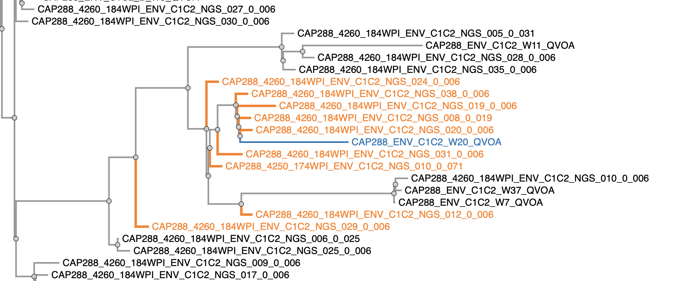
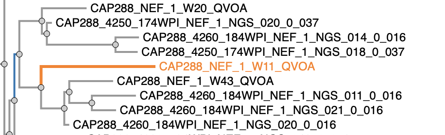
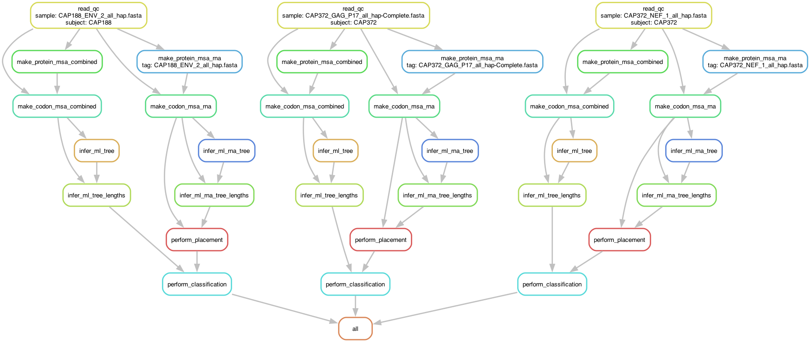

# Timing of QVOA strains using RNA pre-treatment data

<a href="https://zenodo.org/badge/latestdoi/181484600"></a>

## Overview

This pipeline **times** outgrowth virus (OGV) strains from a single host using serially sampled RNA data. Four different approaches are used to assign dates to unobserved strains. First, each tree is rooted to maximize the root-to-tip to sampling time correlation coefficient. 

### Patristic distance
Given a tree with OGV and RNA strains, this approach simply finds the nearest NGS neighbor (in partistic, i.e. path length sense) for each OGV sequence. To assess reliability of this assignment, we also identify all **K≥1** sequences within a factor of 2x of this smallest distance, and extract the consensus vote to assign the date. The **support** value if the proportion of **K** neighboring sequences that come from the same timepoint. In the example below, there are **9** RNA neighbors to the blue QVOA sequence. The closest one is `CAP288_4260_184WPI_ENV_C1C2_NGS_020_0_006` and the other two are with 2x distance. The blue sequence will be assigned to the `184WPI` timepoint, because most of the neighbors are from that timepoint, and the support value will be `8/9`, because one of teh neighbors has a timestamp of `174WPI`



### Clade support
Here, we start with a QVOA sequence, and go up the tree until we encounter the first internal node that has both QVOA and NGS descendants and that has a minimum of 0.90 bootstrap support. We then assign a timestamp and support to the QVOA sequence using the same majority rule as for the patristic distance for all the nodes in the clade. In the example below, to date `CAP288_NEF_1_W11_QVOA`, we walk up the tree to the first supported node (blue) and look at its RNA descendants, of which there are **6** AND 5/6 come from `184WPI`, yielding the assignment of `184WPI` for the QVOA sequence and support of 5/6.



### Placement

Phylogenetic placement using modified IgSCUEAL. The support value is the model weight ([0-1]) assigned to the branches with teh corresponding label

### Regression

The linear regression molecular clock method, essentially the same as in [the Jones et al](https://www.pnas.org/content/115/38/E8958) paper.

<p>

## Implementation 

### Dependancies

1. `HyPhy v2.4` -- the `develop` branch from [github.com/veg/hyphy](github.com/veg/hyphy)
2. `mafft` for MSA generation
3. `FastTree` for phylogeny inference
4. `phylotree.js` for tree processing and visualization [note; there is a custom JS script for performing dating steps that is included in `scripts`]
5. `snakemake` for workflow management

#### Workflow

The workflow for sample classification is implemented as a [Snakemake](https://snakemake.readthedocs.io/en/stable/) workflow, encoded in the `Snakemake` file, and can be graphically summarized as follows (for a specific sample):



After the pipeline has completed, you need to run 

```
$python3 scripts/result-summary.py -d results/dating/ -j data/conversion.json -o results/summary.csv
```

to generate the overall summary CSV file.

---

The high level directory structure contains the following components

```
├── HBL               [HyPhy scripts]
│   ├── data
│   ├── data_filter-2.bf
│   ├── data_filter.bf
│   ├── lib
│   └── scripts
├── README.md         [This file]
├── Snakefile         [Snakemake configuration file]
├── data              [unprocessed FASTA files]
│   ├── CAP188
│   ├── CAP206
│   ├── CAP217
│   ├── CAP257
│   ├── CAP287
│   ├── CAP288
│   ├── CAP302
│   ├── CAP316
│   ├── CAP336
│   └── conversion.json. [Color codes and WPI to pre-ART conversions]
├── img                  [Images for this file]
│   ├── 1.png
│   ├── 2.png
│   └── 3.pdf
├── results              [Results generated by the pipeline]
│   ├── alignments	     [Alignments]
│   ├── dating		     [QVOA/OGV dating results]
│   └── trees            [Trees inferred by the pipeline]
├── samples.json         [Manifest of files to be processed by the pipeline]
├── scripts
│   └── result-summary.py[Penultimate summary script]

```

Within specific resutls directories, the following files are created **for each input FASTA**

#### `alignments` directory
```
CAP316/
├── CAP316_ENV_3_all_hap.fasta_combined.msa           
    [RNA+QVOA nucleotide in-frame sequences, aligned]
├── CAP316_ENV_3_all_hap.fasta_combined_nuc.fas
    [RNA+QVOA nucleotide in-frame sequences, not aligned]
├── CAP316_ENV_3_all_hap.fasta_combined_protein.fas
    [Translated RNA+QVOA nucleotide in-frame sequences, not aligned]
├── CAP316_ENV_3_all_hap.fasta_combined_protein.msa
    [Translated RNA+QVOA nucleotide in-frame sequences, aligned]
├── CAP316_ENV_3_all_hap.fasta_nuc.fas
    [In frame RNA nucleotide in-frame sequences, not aligned]
├── CAP316_ENV_3_all_hap.fasta_protein.fas
    [Translated RNA nucleotide in-frame sequences, not aligned]
├── CAP316_ENV_3_all_hap.fasta_qvoa.fas
    [QVOA/OGV in-frame sequences, not aligned]
├── CAP316_ENV_3_all_hap.fasta_rna.msa
    [RNA+QVOA nucleotide in-frame sequences not aligned]
...

```

#### `trees` directory

```
CAP316/
├── CAP316_ENV_3_all_hap.fasta_combined.nwk
    [Psuedo-ML FastTree topology for QVOA + RNA sequences]
├── CAP316_ENV_3_all_hap.fasta_rna.nwk
    [Psuedo-ML FastTree topology for RNA sequences]

```

#### `dating` directory

```
CAP336/
├── CAP336_ENV_4_all_hap.fasta.scueal
	[alignment+tree file used by HyPhy for phylogenetic placement]
├── CAP336_ENV_4_all_hap.fasta.scueal.hyphy
	[auxiliary file generated by HyPhy during phylogenetic placement]
├── CAP336_ENV_4_all_hap.fasta.scueal.hyphy-data
	[auxiliary file generated by HyPhy during phylogenetic placement]
├── CAP336_ENV_4_all_hap.fasta_classification.csv
	[Summary classification (see below)]
├── CAP336_ENV_4_all_hap.fasta_full_placement.tsv
	[phylogenetic placement extended results]
├── CAP336_ENV_4_all_hap.fasta_placement.tsv
	[phylogenetic placement brief results]
```

#### Alignment preparation

For each individual and each genomic region, we performed the following steps to generate in-frame codon alignments for subsequent analysis. Sequence names in the input files are expected to encode their origin (RNA vs QVOA): any sequence whose name matched the regexp `(QVOA)|(OGV)` are interpreted as outgrowth virus. 

```
CAP188_xxxx_000WPI_ENV_C2C3_OGV_B-W36
                            --- [OGV]
CAP188_4260_185WPI_ENV_C2C3_NGS_046_0.002
            ------ [Time stamp in weeks post-infection]
```
1. Translate each of the **RNA** nucleotide sequences into protein sequences using 3 forward reading frames. Keep track those that are in frame. _Note : for some of the alignments **none** of the sequences were in frame, typically because the reads were **stitched** from discontinuous genomic regions [e.g. due to variable loop removal]. For such alignments, manual corrections were first performed to nudge the reads into frames_


2. Reads that were **not** in frame, and QVOA reads were codon aligned to **each** of the in-frame reads using a codon-aware Smith-Waterman algorithm implemented in `HyPhy`, picking the best-scoring pair to correct frame-shifts.

3. The resulting in-frame sequences were translated to amino-acids, mapping all ambiguous codons to `?` (e.g. `A-A`).

4. A multiple sequence alignment (MSA) was generated from translated protein sequences using `mafft`

5. Original codon sequences are mapped to aligned protein sequences using a script in `HyPhy`. Identical sequences (which do not contribute any information to phylogenetic analyses) are removed at this stage.

6. ML phylognetic trees are reconstructed using `FastTree` (slow option) for RNA sequences **only** (these are later used for phylogenetic placement) and for RNA+QVOA 

7. The pipeline will **compress** identical sequences, i.e. only one copy will be retained. The copy number will (including single copies, i.e. `1`) will be appended to sequence names. 

> **Important:** adjust the paths to various executables, like HYPHY and FastTree, in the `Snakefile` before running the pipeline

